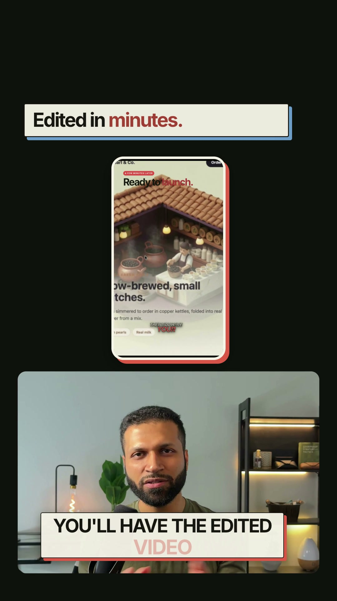

# Social Talking-Head Video Skill

An agent skill for turning existing talking-head, founder, interview, or tutorial footage into polished vertical social videos for Instagram Reels, TikTok, and YouTube Shorts.

It guides an agent through asset triage, reference analysis, transcript-driven editing, word-timed dynamic captions enabled by default, picture-in-picture A-roll, full-screen B-roll, product screen recordings, motion graphics, calibrated motion-synced SFX, review, and final render verification.

## Example

[](examples/ai-shorts-editing-assistant-final.mp4)

[Watch or download the MP4](examples/ai-shorts-editing-assistant-final.mp4). This example demonstrates a typed chat hook, product screen recording, animated asset cards, dynamic captions, borderless presenter PiP, a complete 9:16 edit shown inside a phone frame, platform-safe spacing, and motion-synced SFX.

The composition uses a conservative shared Instagram/TikTok safe zone: essential top copy begins below `y=320` on the 1080×1920 master, while the presenter card retains breathing room above the bottom platform controls.

## What the agent asks first

Before it begins production, the skill collects three compact groups of information:

1. **Source and outcome** — talking-head footage, destination platform, target duration, language, and desired call to action.
2. **Available assets** — logos, brand files, screenshots, screen recordings, B-roll, music, sound effects, product footage, and references.
3. **Style and constraints** — visual references, colors and type, caption energy, presenter treatment, pacing, safe zones, and elements to avoid.

The agent inventories files already supplied before requesting more material. If you delegate creative decisions, it records its assumptions in the project brief before building.

## Install

Clone or download this repository, then keep the entire folder together when placing it in your harness's skill directory.

### Codex

```bash
cp -R social-talking-head-video "${CODEX_HOME:-$HOME/.codex}/skills/"
```

### Agents-compatible harnesses

```bash
cp -R social-talking-head-video "$HOME/.agents/skills/"
```

### Skills CLI

After this repository is published:

```bash
npx skills add <owner>/<repo>
```

For another coding harness, configure its skill or instruction loader to read this repository's `SKILL.md` and preserve the relative `assets/`, `references/`, and `scripts/` paths.

## Use

Ask your agent:

```text
Use $social-talking-head-video to turn my talking-head clip into a polished vertical social video.
```

The agent will run the intake before production. You can provide a folder instead of listing every asset manually; the included media inventory script probes common video, audio, image, and font formats.

## Requirements

- Python 3.10+
- FFmpeg and FFprobe
- Node.js and a Chromium-based browser
- HyperFrames, installed separately

Install or refresh the supporting HyperFrames workflow with:

```bash
npx hyperframes skills update talking-head-recut
```

## Repository contents

- `SKILL.md` — complete agent workflow and guardrails
- `references/intake.md` — three-part intake gate
- `references/editorial-system.md` — A-roll/B-roll and caption design system
- `references/production-and-qa.md` — approval, render, and delivery checks
- `references/sound-design.md` — calibrated under-dialogue SFX placement and verification
- `assets/brief-template.md` — production brief template
- `assets/caption-styles.css` — adaptable semantic caption treatments
- `assets/social-safe-zone-overlay.svg` — conservative Reels/TikTok UI exclusion guide
- `scripts/inventory_media.py` — asset inventory and metadata probing
- `scripts/group_transcript.py` — word-timestamp to caption-group helper
- `examples/ai-shorts-editing-assistant-final.mp4` — finished 9:16 reference edit

The skill intentionally discourages generated-looking shortcuts such as decorative status pills, presenter labels, gratuitous glassmorphism, and arbitrary caption styling.
